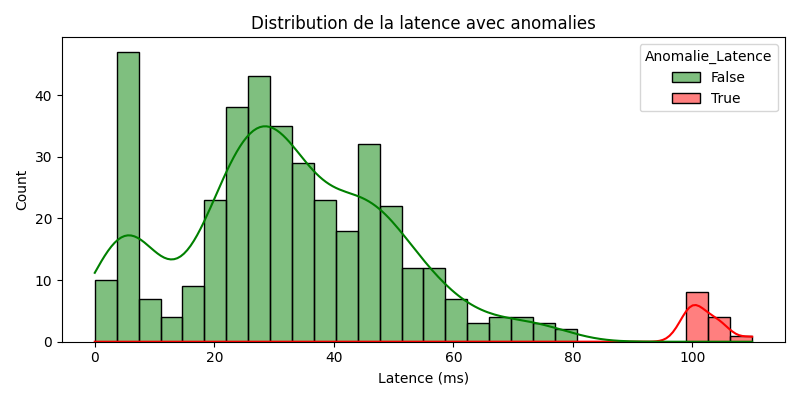
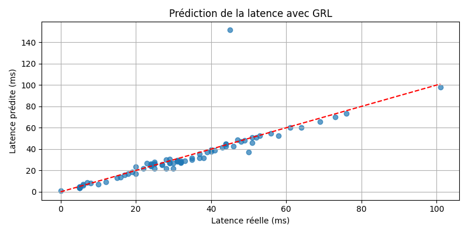

# Rapport d’analyse sur l’impact de l’unlearning sur les performances des modèles IA en réseau 5G

---

## Page de garde

**Université Paris Cité**  
**Master 1 Réseaux et Systèmes Autonomes**  

**Titre du projet** : Rapport d’analyse sur l’impact de l’unlearning sur les performances des modèles IA en réseau 5G

**Sous-thèmes** :  
– Développement et test d’un modèle IA pour l’optimisation du réseau.  
– Implémentation et expérimentation d’unlearning sur un dataset 5G.  
– Comparaison des performances avant et après l’unlearning.  
– Recommandations sur l’intégration de l’unlearning dans les systèmes de gestion des réseaux 5G.

**Réalisé par** :  
Ndeye Cisse Gaye & Thininane Ziane  

**Date** : Mai 2025  

---

## 1. Introduction

Ce projet TER a pour objectif d’analyser la qualité de service (QoS) dans un réseau 5G en utilisant des techniques de machine learning, puis d’évaluer l’impact de l’unlearning sur les performances d’un modèle IA. L’unlearning permet de supprimer l’influence d’une variable (par exemple ici : le type d’application) sans avoir à réentraîner complètement le modèle.

L’approche s’est déroulée en trois grandes phases :  
1. Analyse des données et détection d’anomalies  
2. Construction d’un modèle de prédiction de la latence  
3. Implémentation de l’unlearning et comparaison des performances

---

## 2. Analyse des données et détection d’anomalies

### Distribution de la latence

**Analyse** : La latence est généralement concentrée autour de 10 à 50 ms. Peu de valeurs dépassent 100 ms, seuil que nous avons utilisé pour détecter les anomalies.

### Distribution du signal

**Analyse** : La majorité des signaux mesurés sont inférieurs à -90 dBm, ce qui indique une réception souvent faible. Cela impacte directement la qualité du service.

### Corrélation entre variables

**Analyse** : Forte corrélation entre la bande passante requise et allouée. Une corrélation négative entre latence et signal dBm montre que le signal influence fortement la latence.

---

### Anomalies globales

**Analyse** : La majorité des points sont normaux. Quelques types d’anomalies combinées apparaissent, surtout lorsque la bande passante est élevée mais mal allouée.

### Anomalies spécifiques
- Bande passante : 
  **Analyse** : Aucun cas d’anomalie n’a été détecté selon ce critère.
- Latence : 
  **Analyse** : Quelques valeurs dépassent 100 ms et sont bien repérées comme anomalies.
- Signal : 
  **Analyse** : Beaucoup d’observations ont un signal trop faible (< -90 dBm), ce qui en fait l’anomalie la plus fréquente.

---

## 3. Modèle IA de prédiction de latence

Nous avons développé un réseau de neurones profond avec six couches cachées pour prédire la latence réseau à partir des variables QoS. Le modèle donne de bons résultats, comme illustré ci-dessous.

**MSE du modèle classique : 74.91**

**Analyse** : Le modèle classique présente une bonne capacité de généralisation avec une erreur moyenne raisonnable. Les prédictions suivent bien la réalité malgré quelques cas extrêmes.

---

## 4. Implémentation d’unlearning

### A. Suppression ciblée (filtrage)

Nous avons d’abord testé une méthode simple d’unlearning consistant à retirer toutes les lignes associées à l’application `Video`, puis à réentraîner un modèle classique sur les données restantes. Cela permet d’observer l’effet direct de la suppression de données sur la performance.

> Ce modèle a obtenu une MSE de **87.19**, très proche du modèle original, confirmant une faible dépendance de la latence à l’application `Video` dans ce jeu de données.

### B. Gradient Reversal (adversarial learning)

Nous avons ensuite modifié l’architecture du modèle pour intégrer un **adversaire** chargé de prédire le type d’application à partir des représentations internes du modèle. Grâce au mécanisme de **Gradient Reversal**, nous avons empêché cette information d’influencer le modèle principal.

> Le modèle avec Gradient Reversal a obtenu une MSE de **1131.93**, ce qui indique une nette perte de précision mais un unlearning réussi.

**Analyse** : La chute des performances est attendue : en forçant le modèle à ignorer une information utile, on sacrifie une partie de la précision. Cela montre bien que le désapprentissage est actif.

---

## 5. Pourquoi comparer les deux méthodes d’unlearning ?

Comparer ces deux approches nous permet de :

- Contraster une stratégie simple (filtrage) avec une stratégie plus avancée (réseau adversaire)
- Évaluer si l’unlearning dégrade les performances globales du modèle
- Identifier les cas où une suppression ciblée suffit et ceux où un désapprentissage actif est préférable

---

## 6. Recommandations pour les réseaux 5G

- Utiliser l’unlearning pour **supprimer des biais ou des données sensibles** sans tout réentraîner
- Intégrer un module adversaire dans les architectures IA pour **contrôler la sensibilité aux variables protégées**
- Utiliser l’unlearning dans les cas de **désactivation rapide** d’un service (application, type de trafic)

---

## 7. Conclusion

Le projet a permis d’identifier des anomalies réseau, de construire un modèle prédictif fiable, et d’expérimenter deux méthodes d’unlearning efficaces. Cette démarche ouvre la voie à l’intégration de l’IA responsable dans les réseaux mobiles intelligents de prochaine génération.
