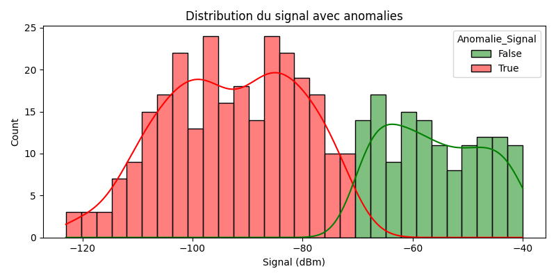

  

# Rapport Phase 1 – Projet TER  
## Analyse et Détection d’Anomalies dans un Réseau 5G  
### Unlearning dans les Réseaux 5G à l’aide de l’Intelligence Artificielle  

---

**Université Paris Cité**  
Master 1 Réseaux et Systèmes Autonomes (RSA)  
Encadrant : *[Nom du professeur]*  
Étudiantes : **Ndeye Cisse Gaye**, **Thinhinane Ziane**  
Date : Mai 2025

---

## 1. Objectif de la Phase 1

Cette première phase vise à :
- Explorer les données d’un réseau 5G
- Détecter des **anomalies réseau** susceptibles de nuire à la qualité de service (QoS)
- Préparer les entrées identifiées à une future **suppression sélective (unlearning)** dans un modèle d’intelligence artificielle.

---

## 2. Données utilisées

- **Nom du dataset** : *Quality of Service 5G.csv*  
- **Source** : Kaggle  
- **Colonnes principales** :
  - Latence (`Latency`)
  - Puissance du signal (`Signal_Strength`)
  - Bande passante requise et allouée (`Required_Bandwidth`, `Allocated_Bandwidth`)
  - Type d’application, timestamp...

---

## 3. Méthodologie

### 3.1 Exploration des variables
- **Latence** : en millisecondes (ms)
- **Signal** : en dBm (plus c’est négatif, plus c’est faible)
- **Bande passante** : Kbps ou Mbps → convertie en Mbps

### 3.2 Règles d’anomalie
| Type d’anomalie        | Condition                          |
|------------------------|------------------------------------|
| Anomalie de latence    | `Latency > 100 ms`                 |
| Anomalie de signal     | `Signal_Strength < -90 dBm`        |
| Anomalie de bande passante | `Allocated < Required`      |

Une **anomalie globale** est marquée si **au moins une** de ces conditions est vraie.

---

## 4. Résultats

Nombre de cas détectés :

- Anomalies de latence : **7 cas**
- Anomalies de signal : **143 cas**
- Anomalies de bande passante : **0 cas**
- Anomalies globales : **143 cas**

---

## 5. Visualisations

> **Figure 1** – Anomalies de bande passante  
> 

> **Figure 2** – Distribution de la latence avec anomalies  
> 

> **Figure 3** – Distribution du signal avec anomalies  
> 

> **Figure 4** – Anomalies globales (latence, signal, bande passante)  
> 

---

## 6. Interprétation

- La **majorité des anomalies** sont causées par un **signal faible** (< -90 dBm), ce qui est cohérent avec des environnements 5G saturés.
- Les cas de **latence élevée** sont rares mais doivent être surveillés.
- L’**allocation de bande passante** est bien respectée dans ce dataset.

---

## 7. Vers la Phase 2 – Unlearning

Les entrées marquées comme anomalies (latence, signal, ou bande passante) seront utilisées pour :
- Expérimenter des techniques d’unlearning, notamment :
  - Gradient Reversal
  - Federated Unlearning
  - Influence Functions
- Le fichier `anomalies_detectees.csv` sert de base pour ces tests.

---

## 8. Conclusion

Cette phase a permis de :
- Comprendre les données réseau 5G
- Définir des critères simples d’anomalie
- Créer un pipeline de détection robuste et automatisable

**Prochaine étape** : mise en œuvre de l’unlearning avec les données marquées comme anomalies.

---

*Projet réalisé avec Python, Pandas, Matplotlib et Seaborn – Visual Studio Code – Mai 2025*
